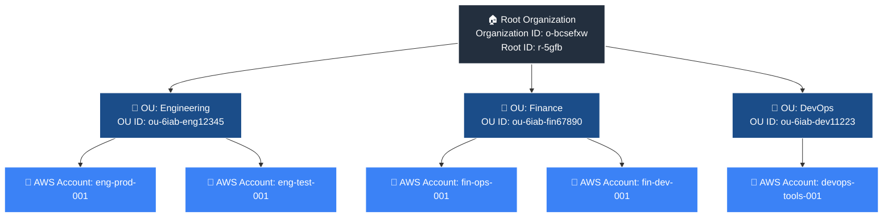

## 🏗️ AWS Organization Hierarchy: 

-----

| Term                | Example           | Description                                                                                                                  | Level                 |
| ------------------- | ----------------- | ---------------------------------------------------------------------------------------------------------------------------- | --------------------- |
| **Organization ID** | `o-bcsefxw`    | The global identifier for your entire AWS Organization — it’s like your *company ID* in AWS.                                 | Entire organization   |
| **Root ID**         | `r-5gfb`          | The top-most **Organizational Unit (OU)** that contains all other OUs and accounts. Every Organization has exactly one root. | Top-level OU          |
| **OU ID**           | `ou-6iab-xxxxxxx` | A child Organizational Unit under the root (e.g., Finance, DevOps).                                                          | Nested under the root |

-----
-----

## 🧩 AWS Identity & Access Concepts — and How They Relate in the Organization Hierarchy

| **Concept** | **What It Is** | **Where It Applies in the Hierarchy** | **Real-World Analogy** | **Relation to Others** |
|--------------|----------------|---------------------------------------|--------------------------|--------------------------|
| 🏢 **Service Control Policy (SCP)** | Organization-level *guardrails* that restrict what actions accounts can take — even if IAM allows them. | **Root** and **Account** levels in **AWS Organizations** (not OU yet in FortiCNAPP). | **Company-wide HR policy**: “No one can access payroll.” | SCPs are *outer boundaries* — they override IAM permissions. |
| 🗂️ **Organizational Unit (OU)** | A logical grouping of AWS accounts under a parent organization root. SCPs can be attached here too. | **Mid-level** between Root and Account. | **Department** (e.g., “Finance,” “Engineering”). | OUs inherit SCPs from their parent (Root). |
| 🧱 **Account** | An isolated AWS environment where users, roles, and resources live. | **Lowest level** in the Org hierarchy. | **Subsidiary or branch office.** | Each account enforces SCPs + IAM policies together. |
| 👥 **IAM (Identity and Access Management)** | The AWS service that manages *who can do what* inside a single account. | **Inside an Account** | **Company HR system** | IAM enforces identity-level permissions under the SCP limits. |
| 🧑‍💼 **IAM Role** | A temporary identity used by AWS services, users, or external systems to act in your account. | **Inside an Account** | **Job title** — e.g., “BackupManager” | Roles are governed by IAM policies and Trust policies. |
| 📜 **IAM Policy** | JSON-based permission document defining *what actions* are allowed or denied. | **Attached to IAM Roles, Users, or Groups** | **Job description** — defines allowed tasks. | Policies give specific permissions within the account. |
| 🔒 **Trust Policy (AssumeRole)** | Defines *who* can assume a role (e.g., from another account or service). | **Attached to IAM Roles** | **Badge access rule** — “Only people from Dept A can wear this badge.” | Controls **which principals** can use an IAM role. |
| 📦 **Resource Policy** | A policy *on a resource* (like an S3 bucket or KMS key) defining who can access it. | **At the resource level** inside an account. | **Guest list** on the resource itself. | Adds another layer of permissions *directly* on resources. |

-----
-----

| **Component** | **Description** | **FortiCNAPP Usage / Notes** |
|----------------|-----------------|-------------------------------|
| 📨 **SNS Topic** | An **Amazon Simple Notification Service (SNS)** topic is a logical access point that acts as a communication channel, grouping multiple endpoints such as AWS, Amazon SQS, HTTP/S, or email addresses. | Required for **all CloudTrail integrations**. FortiCNAPP can use an **existing SNS topic** or create one automatically if not present. |
| 📬 **SQS Queue** | **Amazon Simple Queue Service (SQS)** enables distributed applications to exchange messages asynchronously. SNS and SQS together deliver notifications immediately while persisting messages for later processing. | Required for **all CloudTrail integrations**. Used alongside SNS to deliver CloudTrail events to FortiCNAPP. |
| 🗃️ **S3 Bucket** | An **Amazon S3 bucket** is a container for objects. CloudTrail stores log files in S3 buckets. | Required for **all CloudTrail integrations**. FortiCNAPP can use an existing S3 bucket or create one in the designated AWS account. |
| ☁️ **CloudTrail** | **AWS CloudTrail** records user, role, or service actions across your AWS account for governance, compliance, and audit purposes. | Required to capture and deliver event logs to FortiCNAPP. FortiCNAPP can use an **existing CloudTrail** or create a new one. |
| 🔐 **IAM Cross-Account Role** | An **IAM cross-account role** grants FortiCNAPP access to AWS resources for configuration assessment and CloudTrail event analysis. | Required for **read-only access**. Includes two policies: • **FortiCNAPP custom audit policy** – read-only access to configuration resources. • **FortiCNAPP custom IAM policy** – read-only access to ingest CloudTrail logs. |
| ⚠️ **Important Note** | Ensure your **IAM cross-account role** and **S3 bucket** are created in the **same AWS account** — regardless of setup method (manual, CloudFormation, or Terraform). | This is due to **legacy AWS access control rules**. Cross-account access alone is **not sufficient** to bypass these S3 restrictions. |

