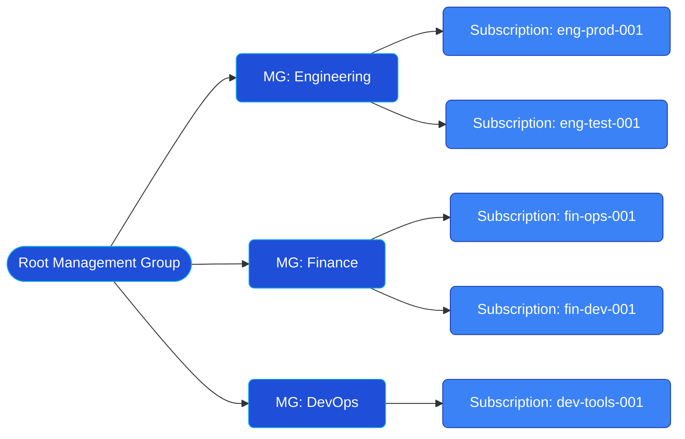

## 🏗️ Azure Management Hierarchy:

---


---
---

| AWS Concept                         | Azure Equivalent                    | Description                                                                           |
| ----------------------------------- | ----------------------------------- | ------------------------------------------------------------------------------------- |
| **Root Organization**               | **Root Management Group**           | The top-level container in Azure. All resources and management groups exist under it. |
| **Organizational Unit (OU)**        | **Management Group (MG)**           | Logical containers that help organize subscriptions for policy, RBAC, and compliance. |
| **AWS Account**                     | **Azure Subscription**              | The billing and isolation boundary for Azure resources.                               |
| **Service Control Policies (SCPs)** | **Azure Policy / RBAC Assignments** | Used to enforce compliance and security standards.                                    |

---
---

```mermaid
graph TD

    %% Tenant and Identity Layer
    A[🌐 Entra ID (Azure Active Directory)] --- B[🧭 Microsoft Graph API]
    B --- A
    A --- C[🤝 Managed Identities]
    
    %% Resource Query Layer
    D[⚙️ Azure Resource Graph] --- F[💠 Subscriptions]
    D --- G[🗂️ Resource Groups]
    D --- H[🧱 Resources]

    %% Azure Management Hierarchy
    Z[🏢 Root Management Group] --> Y[📁 Management Group: Engineering]
    Z --> X[📁 Management Group: Finance]
    Z --> W[📁 Management Group: DevOps]

    Y --> F
    X --> F
    W --> F

    F --> G
    G --> H

    %% Governance and Control
    I[🔐 Azure Policy]
    J[👥 RBAC (Role-Based Access Control)]
    K[🧑‍💼 Role Definitions]
    L[🪪 Role Assignments]
    M[📜 Policy Initiatives / Blueprints]

    I --- Z
    I --- F
    J --- F
    J --- G
    J --- H
    K --- J
    L --- J
    M

```
