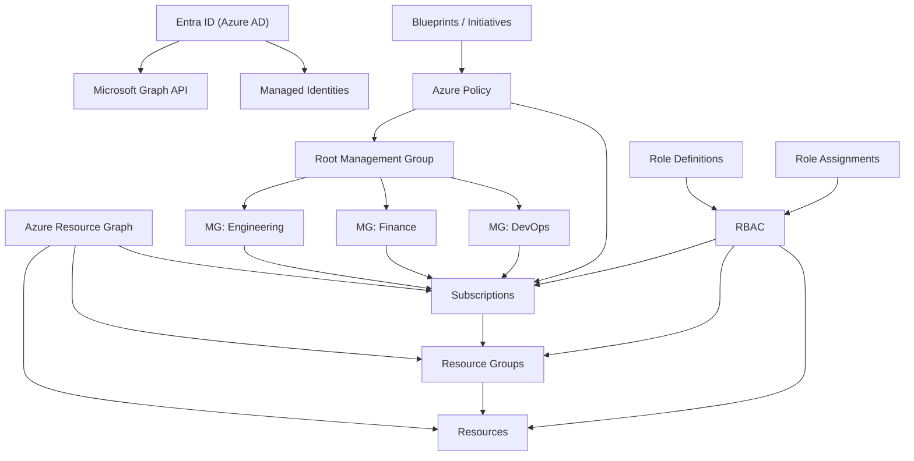

## 🏗️ Azure Management Hierarchy:

---

---
---

| AWS Concept                         | Azure Equivalent                    | Description                                                                           |
| ----------------------------------- | ----------------------------------- | ------------------------------------------------------------------------------------- |
| **Root Organization**               | **Root Management Group**           | The top-level container in Azure. All resources and management groups exist under it. |
| **Organizational Unit (OU)**        | **Management Group (MG)**           | Logical containers that help organize subscriptions for policy, RBAC, and compliance. |
| **AWS Account**                     | **Azure Subscription**              | The billing and isolation boundary for Azure resources.                               |
| **Service Control Policies (SCPs)** | **Azure Policy / RBAC Assignments** | Used to enforce compliance and security standards.                                    |

---
---
### 🧩 Azure Identity & Access Concepts — and How They Relate in the Management Hierarchy



---

| **Concept**                              | **What It Is**                                                                                               | **Where It Applies in the Hierarchy**                     | **Real-World Analogy**                        | **Relation to Others**                                                              |
| ---------------------------------------- | ------------------------------------------------------------------------------------------------------------ | --------------------------------------------------------- | --------------------------------------------- | ----------------------------------------------------------------------------------- |
| 🏢 **Management Group**                  | Logical container that organizes Azure subscriptions under the root for unified policy and RBAC.             | **Above Subscriptions**, under **Root Management Group**. | **Department or Division**                    | Policies and RBAC inherit downward.                                                 |
| 💠 **Subscription**                      | Boundary for billing, quotas, and access. Holds Resource Groups and resources.                               | **Below Management Groups**                               | **Business Unit or Project**                  | Receives inherited governance from MG.                                              |
| 🤝 **Managed Identity**                  | Identity for a resource to authenticate to Azure services securely.                                          | **At Resource Level**                                     | **Employee Badge**                            | Removes the need for stored credentials.                                            |
| 🧩 **Entra ID (Azure Active Directory)** | Identity provider for all Azure identities and authentication.                                               | **Tenant-wide, outside MG hierarchy.**                    | **Corporate Directory / HR System.**          | Central to RBAC, policies, and authentication.                                      |
| 🧭 **Microsoft Graph API**               | Unified API endpoint (`graph.microsoft.com`) to query, manage, and automate Microsoft 365 and Entra ID data. | **Tenant-wide**                                           | **Company Directory Database API.**           | Replaces Azure AD Graph API; used for managing users, groups, roles, policies, etc. |
| ⚙️ **Azure Resource Graph**              | Query engine for exploring and analyzing resources across subscriptions.                                     | **Across MGs and Subscriptions**                          | **Company Asset Tracker / Inventory Search.** | Provides resource-level visibility via `az graph query` or ARM REST API.            |
| 🗂️ **Resource Group**                   | Logical container for related Azure resources.                                                               | **Inside a Subscription**                                 | **Project Folder**                            | Groups resources for lifecycle and access management.                               |
| 🧱 **Resource**                          | Any deployable Azure entity (VM, Storage, App Service, etc.).                                                | **Inside a Resource Group**                               | **Individual Asset**                          | Enforces inherited policies and RBAC.                                               |
| 🔐 **Azure Policy**                      | Rules for compliance and governance (e.g., enforce allowed regions or VM sizes).                             | **At any level (MG, Subscription, RG)**                   | **Compliance Manual**                         | Works with RBAC — defines *what can exist*.                                         |
| 👥 **RBAC (Role-Based Access Control)**  | Authorization system defining who can do what to which resources.                                            | **At any level (MG → Resource)**                          | **HR Permission Matrix**                      | Uses roles and assignments tied to Entra ID identities.                             |
| 🧑‍💼 **Role Definition**                | Set of actions a role allows (e.g., Reader, Contributor).                                                    | **Part of RBAC**                                          | **Job Title**                                 | Defines allowed actions.                                                            |
| 🪪 **Role Assignment**                   | Binds a Role to a User/Group/Service Principal at a scope.                                                   | **Any level**                                             | **HR Assignment (“Alice is Manager”)**        | Enforces access rights.                                                             |
| 📜 **Blueprint / Policy Initiative**     | Bundle of policies, roles, and ARM templates for standard setups.                                            | **At MG or Subscription**                                 | **Company Playbook / Compliance Kit**         | Ensures consistent deployment.                                                      |


---
---


```mermaid
graph TD
  A[🌐 Microsoft Entra ID Tenant] --> B[👤 User: alex@company.com]
  A --> C[👥 Groups / Service Principals / Managed Identities]

  B -->|Authenticated via Token| D[🔐 Azure Resource Manager (ARM)]

  D --> E[🏢 Root Management Group]
  E --> F[💠 Subscription]
  F --> G[🗂️ Resource Group]
  G --> H[🧱 Resource]

  F --> I[🧩 RBAC Role Assignments]
  I --> B
  I -->|Role Definition| J[⚙️ Owner / Contributor / Reader]

  style A fill:#2563eb,stroke:#1e40af,color:#fff
  style D fill:#334155,stroke:#000,color:#fff
  style E,F,G,H fill:#3b82f6,stroke:#1e40af,color:#fff
  style I,J fill:#7e22ce,stroke:#581c87,color:#fff

```
